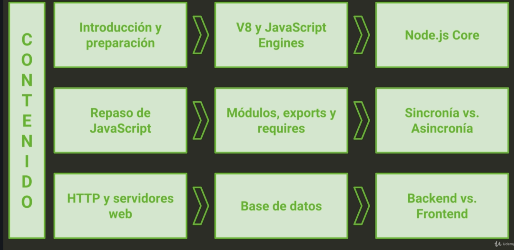
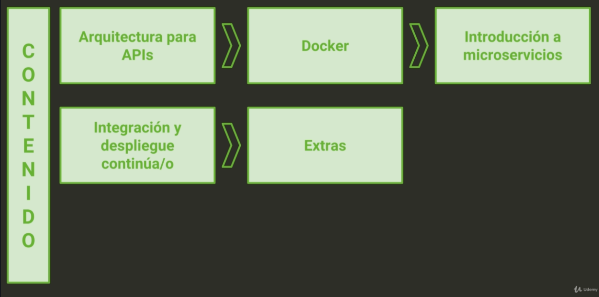

# NODE-JS

Este curso sta basado en [La Biblia de Node.js: conviértete en un experto backend](https://www.udemy.com/course/la-biblia-de-nodejs/) de [Marluan Espiritusanto](https://www.linkedin.com/in/marluan-espiritusanto-guerrero-3a4182115/). Duracióm: 16 horas.

Proceesadores

Código de máquina > Assembly > C , C++ > JavaScript

Node JS está escrito en C++

V8 engine está escrito en C++

[Engine V8 Repo](https://github.com/v8/v8)

Se puede modificar el V8

