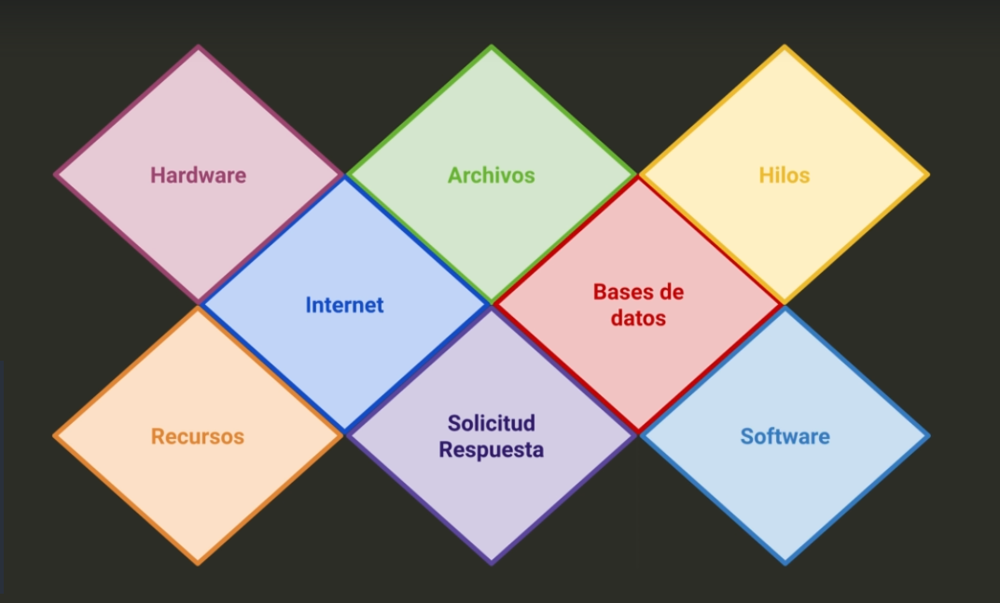
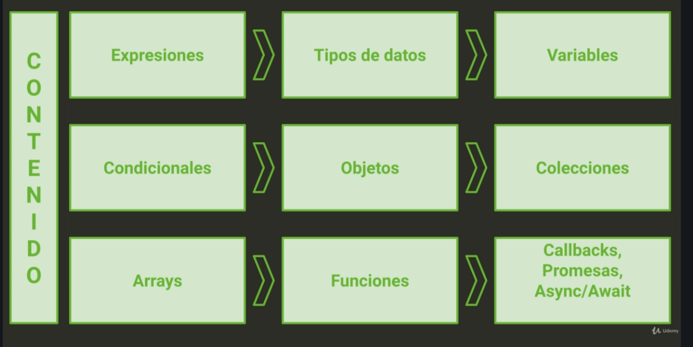
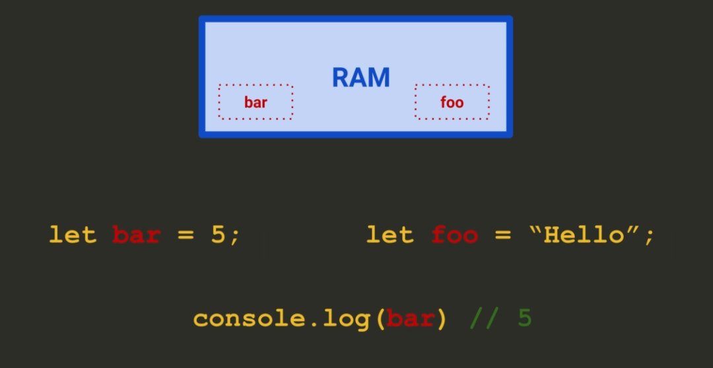
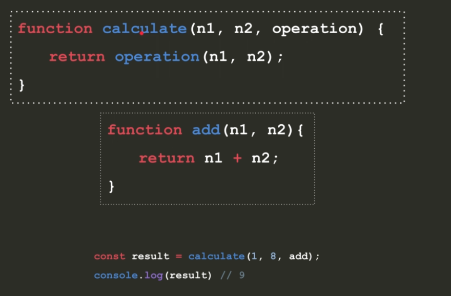

# NODE-JS

Este curso sta basado en [La Biblia de Node.js: conviértete en un experto backend](https://www.udemy.com/course/la-biblia-de-nodejs/) de [Marluan Espiritusanto](https://www.linkedin.com/in/marluan-espiritusanto-guerrero-3a4182115/). Duracióm: 16 horas.


Proceesadores

Código de máquina > Assembly > C , C++ > JavaScript

Node JS está escrito en C++

V8 engine está escrito en C++

[Engine V8 Repo](https://github.com/v8/v8)

Se puede modificar el V8

Node JS es una teecnología de servidor 

Modelo de computación cliente-servidor

Navegador es eel cliente y el Web Server el servidor, se comunican a través del estandar http

Características de Node



Repaso JS



Expresión --> Cualquier cosa que produzca un valor primitivo ej. string, number

Datatypes:

- Object
- String
- Number
- Boolean
- Array (secuencial) - Collections
- Set - Collections
- Map - Collectios
- Function 
- Symbol
- Undefined
- Null

**Variable:**


**Operdores lógicos**

**Condicionales**

**Objetos**

- Object.create()

- object litreal --> JSON

. notation / [] notation
```js
person.name / person["name"]
```

- Class
  
**Colecciones**

- Arrays

- Sets

Los sets son objetos que admiten valores single y no repetición de ningún valor
```js
const numbers = new Set();
numbers.add(5);
numbers.add(6);

console.log(numbers) // { 5, 6 }
```

- Maps

Son diccionarios de estructura objeto que aceptan key y value, no se pueden repetir

```js 
const student = new Map();
students.set("name","Sofia");

console.log(students.get("name")); // Sofia
```

**Bucles**

- for of
- for in

**Funciones**

Es argumento cuando lo pasamos al llamar la función, es parámetro cuando definimos la función.

**Callbacks**

Es una función "x" que se usa como argumento de otra función "y". Cuando se llama a "y", ésta ejecuta "x".

Usualmente, lo que se pasa a "y" es un puntero de "x".


